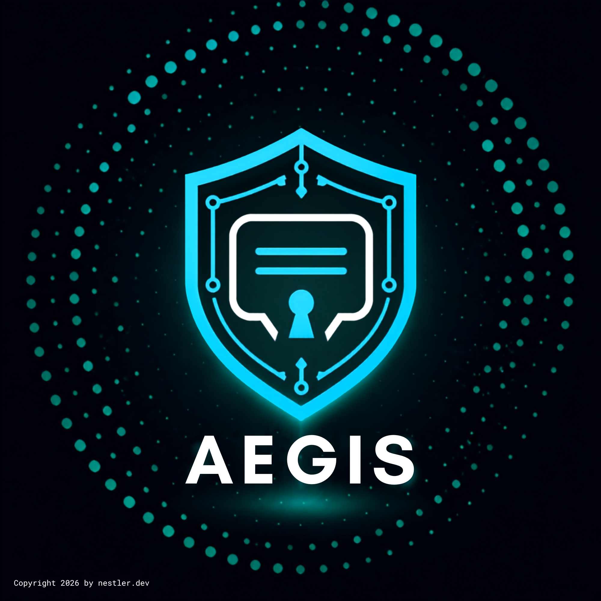
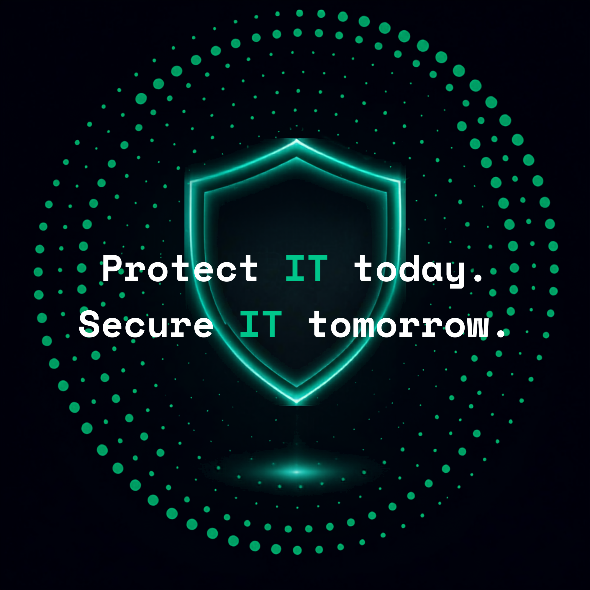

<p align="center">
  
</p>

<p align="center">
  
</p>

# AegisPQC (AEGIS)

> **Federated, Zero-Trust, Post-Quantum Hyper-Secure Messenger**

> ⚠️ **DISCLAIMER: NOT INDEPENDENTLY AUDITED**
>
> AegisPQC implements novel protocol engineering (a hybrid post-quantum ratchet, a federated relay/mailbox network) built from published cryptographic references. **Until a third-party cryptographic audit has been completed, every release, binary, and page of documentation MUST carry a visible "not independently audited" disclaimer, and the software MUST NOT be represented as audited, certified, or production-hardened.**

---

## Table of Contents

1. [Overview](#overview)
2. [Key Advantages over Signal](#key-advantages-over-signal)
3. [Hardware & OS Recommendation](#hardware--os-recommendation-grapheneos--google-pixel-9-pro-series)
4. [System Architecture & Workspace Breakdown](#system-architecture--workspace-breakdown)
5. [Security Model](#security-model)
6. [Cryptographic Agility & Versioning](#cryptographic-agility--versioning)
7. [Compliance Mapping](#compliance-mapping)
8. [Build & Development](#build--development)
9. [Security Disclosure Policy](#security-disclosure-policy)
10. [Non-Goals](#non-goals)
11. [Roadmap](#roadmap)
12. [License](#license)

---

## Overview

**AegisPQC** is a federated, zero-trust, post-quantum-safe messaging platform engineered to defend against global passive network observers, post-quantum decryption threats ("Harvest Now, Decrypt Later"), device seizure, and legal compulsion of infrastructure operators. It provides high-throughput payload streaming, strict metadata elimination at the protocol layer, and hardware-bound vault security.

AEGIS is a **specification and reference implementation**, not a finished, audited product. Anyone deploying it for real-world sensitive communication should read the [Security Model](#security-model) and [Non-Goals](#non-goals) sections in full before relying on it.

---

## Key Advantages over Signal

While the Signal Protocol remains the benchmark for classic mobile end-to-end encryption, AEGIS raises the cryptographic and architectural security ceiling for users who need to defend against more resourceful adversaries than a typical mobile threat model assumes.

| Feature / Metric | Signal | AegisPQC (AEGIS) | Advantage of AEGIS |
| :--- | :--- | :--- | :--- |
| **Post-Quantum Security** | NIST Level 1–3 (PQXDH with ML-KEM-768) | **NIST Security Level 5** (ML-KEM-1024 + brainpool512r1 KEM, ML-DSA-87 + Ed25519) | Maximum defense against "Harvest Now, Decrypt Later" quantum attacks. |
| **Network Anonymity** | Centralized TLS / AWS infrastructure (IP addresses exposed to server) | **Tor-Native Transport** (`arti` Rust stack), cover traffic & fixed-size packet padding | Protection against passive network observation and traffic/timing analysis. |
| **Identity & Metadata** | Phone number registration required; central contact graph lookup | **Zero PII collection**; blind capability tokens; public key is identity | No central contact graph, no PII at registration. |
| **File Payloads** | ~100 MB limit | **Up to 1 GB** out-of-band chunked AEAD streaming, BLAKE3 Merkle tree verified | Support for large binary assets and data files with a bounded RAM footprint. |
| **Server Architecture** | Centralized service | **Federated mailbox network** with Sealed Sender 2.0 | Reduces single points of legal compulsion, compromise, or failure. |
| **Local Device Hardening** | Software-fallback allowed | **Strict zero-fallback policy** (mandatory hardware TEE / StrongBox / Secure Enclave) | App refuses to launch without verified hardware key isolation. |

---

## Hardware & OS Recommendation: GrapheneOS + Google Pixel 9+ Pro Series

To achieve the maximum security posture envisioned by the AEGIS specification (OWASP MASVS-L3 & BSI TR-03183), **AEGIS is strongly recommended to be deployed on GrapheneOS running on Google Pixel 9 Pro or 9 Pro XL (or newer) hardware.**

### Why GrapheneOS?

1. **Minimized Operating System Telemetry:** Reduces OS-level background data flows, complementing AEGIS's zero-PII, protocol-level metadata-minimization architecture.
2. **Hardened Runtime Environment:** Hardened memory allocation (`hardened_malloc`), Control Flow Integrity (CFI), and strict application sandboxing.
3. **Google-Free Stack:** AEGIS operates natively over Tor (`arti`) using federated push mechanics, requiring no Google Play Services or Firebase Cloud Messaging (FCM).

### Why the Google Pixel 9+ Pro Series?

* **Titan M2 Hardware Security Module:** Enforces the strict **zero-fallback policy** via hardware-backed key isolation in Android Keystore (StrongBox/TEE).
* **16 GB RAM Capacity:** Post-Quantum Level 5 cryptography, double-ratchet execution, streaming file buffers, and background Tor circuits are memory-intensive; 16 GB avoids aggressive background process termination.
* **ARMv9 Memory Tagging Extension (MTE):** Hardware-enforced mitigation supporting OWASP MASVS-L3 requirements.
* **Modern High-Efficiency Modem:** Offsets battery drain from continuous Tor circuit maintenance and constant-rate cover traffic.

> **Note on Compatibility:** Devices lacking a hardware enclave (TEE/StrongBox), or running an OS AEGIS cannot attest as trustworthy, will fail the AEGIS hardware initialization check by design (fail-closed, not fail-open).

---

## System Architecture & Workspace Breakdown

AEGIS is built as a modular Rust workspace (`#![forbid(unsafe_code)]` enforced by default, with narrowly scoped, individually audited exceptions only where required for hardware enclave FFI), exporting C-ABI / UniFFI bindings for cross-platform integration:

```text
aegis/
├── aegis-crypto/    # Hybrid PQC (ML-KEM-1024/brainpool512r1, ML-DSA-87/Ed25519, Argon2id, KAT tests)
├── aegis-ratchet/   # Post-Quantum Double Ratchet (PQ-DR), Group Sender-Keys & Multi-Device
├── aegis-vault/     # SQLCipher storage, StrongBox/Enclave hardware isolation, GDPR Art. 17/20 engines
├── aegis-file/      # Streaming engine with chunked BLAKE3 Merkle tree verification
├── aegis-net/       # Tor transport via `arti`, federated mailbox relay, Sealed Sender 2.0, capability tokens
├── aegis-ffi/       # UniFFI / C-ABI export layer for Kotlin (Android), Swift (iOS/macOS), and Desktop
└── platforms/       # UI wrappers (Android Kotlin, iOS Swift, Desktop Tauri v2)
```

Each crate owns one security-relevant responsibility and is designed to be independently reviewable and independently fuzzed as part of the project's ongoing hardening work.

---

## Security Model

AEGIS is designed under a **zero-trust** posture: no relay, transport hop, or federation partner is trusted for confidentiality, integrity, or availability. Every crate boundary above is treated as a trust boundary in its own right, so a compromise of one component is designed to be contained rather than to cascade.

Core design principles:

* **Defense in depth.** Every cryptographic guarantee is built from a hybrid post-quantum + classical primitive pair, so breaking either family alone is insufficient to compromise confidentiality or authenticity.
* **Least privilege for infrastructure.** Federated relays only ever handle authenticated, encrypted, capability-scoped traffic; no relay is a single point of compromise, legal compulsion, or metadata aggregation for the whole network.
* **Fail-closed hardware trust.** The client will not run without verified hardware-backed key isolation, rather than silently degrading to a weaker software fallback.
* **Deniability by design.** As with the Signal Protocol, non-repudiation is intentionally not provided.

A detailed, adversary-by-adversary threat model and component-level risk analysis is maintained by the project and is made available to independent auditors and vetted security researchers under the [Security Disclosure Policy](#security-disclosure-policy); it is intentionally not published in full here.

---

## Cryptographic Agility & Versioning

* All wire-format messages carry an explicit algorithm-suite identifier; suite negotiation is authenticated as part of session establishment so a network adversary cannot force a downgrade to a weaker suite.
* NIST PQC parameter sets are pinned per protocol version (currently ML-KEM-1024 / ML-DSA-87); a cryptanalytic advance against either requires a coordinated protocol version bump, not a silent algorithm swap.
* Every hybrid construction combines exactly one post-quantum and one classical primitive such that breaking either alone is insufficient to compromise confidentiality or authenticity.
* Known-Answer-Test (KAT) vectors from the NIST reference implementations are run in CI on every commit touching `aegis-crypto`.

---

## Compliance Mapping

| Requirement | Mechanism | Status |
| :--- | :--- | :--- |
| OWASP MASVS-L3 (resilience) | Hardware-backed key storage, zero-fallback policy, MTE | Design target |
| BSI TR-03183 (component security) | SBOM generation, reproducible builds | In progress |
| GDPR Art. 17 (right to erasure) | Vault key destruction renders all local ciphertext unrecoverable; no server-side plaintext ever exists to erase | Implemented in `aegis-vault` |
| GDPR Art. 20 (data portability) | Local vault export in a documented, versioned schema | Implemented in `aegis-vault` |
| NIST SP 800-207 (Zero Trust Architecture) | No implicit trust in relay/transport infrastructure; per-session authentication; least-privilege capability tokens | Architectural principle throughout `aegis-net` |

None of the above constitutes a certification. Treat this table as a map of intent and mechanism, not a compliance attestation.

---

## Build & Development

```bash
# Toolchain
rustup toolchain install stable
rustup component add clippy rustfmt

# Build the full workspace
cargo build --workspace --locked

# Run unit + KAT tests
cargo test --workspace --locked

# Lint (deny warnings in CI)
cargo clippy --workspace --all-targets -- -D warnings
```

Platform shells build independently against the `aegis-ffi` UniFFI bindings:

```bash
# Android (Kotlin) bindings
./aegis-ffi/scripts/gen-kotlin.sh

# iOS/macOS (Swift) bindings
./aegis-ffi/scripts/gen-swift.sh
```

Minimum supported Rust version (MSRV) and exact dependency versions are pinned in `Cargo.lock`; CI builds with `--locked` to prevent unreviewed dependency drift from entering a release.

---

## Security Disclosure Policy

Do not open a public issue for a suspected vulnerability. Given the current pre-audit status of this project, treat any finding as high-impact until triaged.

* Report privately to the maintainers' published security contact (PGP key fingerprint to be listed in `SECURITY.md`).
* Include: affected crate/version and reproduction steps or a proof of concept.
* Expect acknowledgment within 5 business days and a coordinated disclosure timeline agreed before any public write-up.

---

## Non-Goals

Explicitly deferred or rejected design goals, so scope creep and audit expectations stay bounded:

* **Reproducible/deterministic builds and SBOM publication** — planned, not yet implemented.
* **Protection against a fully compromised endpoint** — out of scope by definition; no messenger can protect a device that is already under an attacker's control.
* **Anonymity guarantees stronger than the underlying Tor network provides** — AEGIS does not attempt to re-implement or improve on Tor's anonymity properties, only to carry traffic over them correctly.
* **Independent third-party cryptographic audit** — not yet completed. This is the single most important open item; see the disclaimer at the top of this document.

---

## Roadmap

1. Continue cross-platform FFI boundary hardening.
2. Reproducible build pipeline + SBOM (BSI TR-03183 alignment).
3. Federation-level relay authentication hardening.
4. Engage an independent cryptographic auditor; publish findings and remediation status regardless of outcome.
5. Formal verification (e.g., ProVerif/Tamarin model) of the PQ-Ratchet state machine.

---

## License

License to be finalized before first tagged release. Until a `LICENSE` file is present in this repository, no rights are granted to use, copy, modify, or distribute this code beyond viewing the source.
